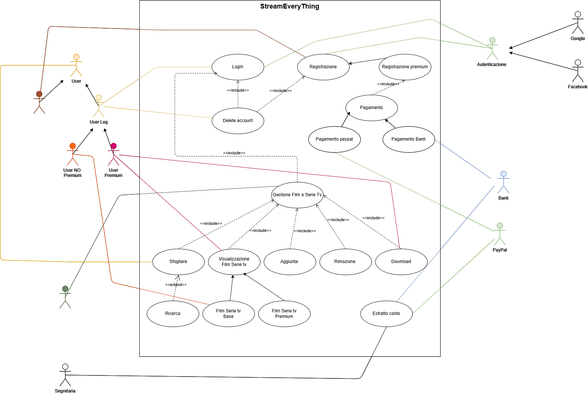

# Use case StreamEveryThing
  

  
---
---
  

## LogIn 
*id: 1*

**Breve descrizione**: L'utente tenta il collegamento con il proprio account tramite le credenziali.
**Attore principale**: User Log  
**Attori secondari**: Autenticatore  
**Precondizioni**: Esistenza dell'account nel sistema.
### Sequenza principale:
    1. L'utente richiede di accedere al sistema.
    2. Il sistema visualizza la pagina di autenticazione.
    3. L'utente inserisce le credenziali.
    4. Il sistema verifica che siano corrette.
    5. Se le credenziali sono corrette:
        5.1 Il sistema garantisce l'accesso.
    6. Altrimenti:
        6.1 Il sistema restituisce un errore sui dati inseriti.

**Post-condizioni**: L'utente ha accesso al proprio account e ai contenuti associati.

### Sequenze alternative:
- Utente non registrato
- Password o User ID dimenticati
- Richiesta di autenticazione a due fattori

  
---
---
  

## Download 
*id: 2*

**Breve descrizione**: L'utente premium richiede il download di un contenuto.
**Attore principale**: Utente Premium  
**Attori secondari**: Nessuno  
**Precondizioni**: 
- L'utente deve:
  - Aver effettuato il login
  - Essere un utente premium
  - Aver saldato l'ultimo pagamento
- Il contenuto richiesto deve essere presente sulla piattaforma

### Sequenza principale:
    1. L'utente cerca il contenuto.
    2. Il sistema verifica che il contenuto sia presente.
    3. Se non è presente:
    3.1 Annulla l'operazione.
    4. Altrimenti:
    4.1 Procede.
    5. Il sistema verifica che l'utente sia collegato.
    6. Se l'utente è collegato:
    6.1 Controlla che sia un utente premium.
    6.2 Se l'utente è premium:
        6.2.1 Controlla che l'ultimo pagamento sia avvenuto.
        6.2.2 Se il pagamento è avvenuto:
                6.2.2.1 Il sistema permette il download.
        6.2.3 Altrimenti:
                6.2.3.1 Richiede di effettuare il pagamento.
    6.3 Altrimenti:
        6.3.1 Richiede di passare al piano premium.
    7. Altrimenti:
    7.1 Richiede di effettuare il login.

**Post-condizioni**: L'utente avrà il contenuto all'interno della propria libreria e disponibile offline (o *online*, a seconda delle specifiche).

### Sequenze alternative:
- Utente non registrato
- Utente non pagante
- Utente non premium
- Contenuto non disponibile
- Download non completato per problemi di connessione

  
---
---

